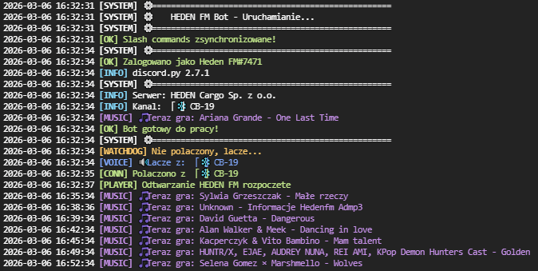
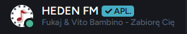
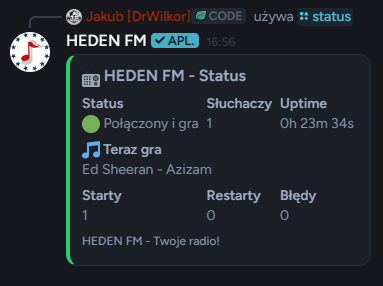

<div align="center">

# 📻 HEDEN FM - Discord Radio Bot


<br>


<br>

### 🎵 Profesjonalny bot radiowy Discord z automatycznym wyświetlaniem aktualnie granej piosenki

<br>

[✨ Funkcje](#-funkcje) •
[📸 Screenshots](#-screenshots) •
[🛠️ Technologie](#️-technologie) •
[📞 Kontakt](#-kontakt)

<br>

---

**🔒 Ten projekt jest Closed Source**

Zainteresowany? [Skontaktuj się ze mną!](#-kontakt)

---

</div>

<br>

## ✨ Funkcje

<table>
<tr>
<td>

### 🎵 Audio & Streaming
- ✅ Wysokiej jakości stream radiowy
- ✅ Automatyczne buforowanie (brak przycięć)
- ✅ Auto-reconnect przy problemach
- ✅ Obsługa wielu formatów audio

</td>
<td>

### 🤖 Automatyzacja
- ✅ Auto-dołączanie gdy ktoś wejdzie
- ✅ Auto-opuszczanie gdy kanał pusty
- ✅ Watchdog - automatyczny restart
- ✅ Health check systemu

</td>
</tr>
<tr>
<td>

### 🎤 Status & Informacje
- ✅ Status z aktualną piosenką
- ✅ Aktualizacja tytułu co 15 sekund
- ✅ Integracja z API radia
- ✅ Statystyki słuchaczy

</td>
<td>

### ⚡ Komendy Slash
- ✅ `/status` - Status bota
- ✅ `/song` - Aktualna piosenka
- ✅ `/restart` - Restart streamu
- ✅ `/join` `/leave` `/ping`

</td>
</tr>
</table>

<br>

## 📸 Screenshots

<div align="center">

### 🖥️ Kolorowe logi w konsoli



<br><br>

### 🎧 Bot na Discord ze statusem piosenki



<br><br>

### 💬 Komendy slash w akcji



</div>

<br>

## 🎨 Przykładowe logi

```
2026-03-06 15:56:43 [SYSTEM] ⚙️ ==================================================
2026-03-06 15:56:43 [SYSTEM] ⚙️     HEDEN FM Bot - Uruchamianie...
2026-03-06 15:56:43 [SYSTEM] ⚙️ ==================================================
2026-03-06 15:56:43 [OK] ✓ Zalogowano jako Heden FM#7471
2026-03-06 15:56:43 [INFO] discord.py 2.7.1
2026-03-06 15:56:43 [INFO] Serwer: HEDEN Cargo Sp. z o.o.
2026-03-06 15:56:43 [MUSIC] 🎵 Teraz gra: Rascal Flatts - Life Is a Highway
2026-03-06 15:56:43 [OK] ✓ Bot gotowy do pracy!
2026-03-06 15:57:04 [VOICE] 🔊 Łączę z: 「❄️」𝙲𝙱-19
2026-03-06 15:57:06 [OK] ✓ Odtwarzanie HEDEN FM rozpoczęte
2026-03-06 15:58:20 [MUSIC] 🎵 Teraz gra: Clean Bandit - Solo
```

<br>

## 🛠️ Technologie

<div align="center">


</div>

### Stack technologiczny:

- **Backend:** Python 3.12+
- **Discord API:** discord.py 2.7.1 z obsługą DAVE E2EE
- **Audio:** FFmpeg z zaawansowanym buforowaniem
- **HTTP:** aiohttp (async requests)
- **Hosting:** Kompatybilny z Docker, IVhost, VPS

<br>

## 💼 Dostępne na zamówienie

<div align="center">

### 🎯 Chcesz takiego bota dla swojej firmy/serwera?

<br>

| Pakiet | Opis |
|--------|------|
| 🎵 **Basic** | Bot radiowy z podstawowymi funkcjami |
| 🎨 **Custom** | Dostosowany do Twoich potrzeb |
| 🏢 **Enterprise** | Pełne wsparcie + hosting + utrzymanie |

<br>

### 📞 Skontaktuj się po wycenę!

</div>

<br>

## 📞 Kontakt

<div align="center">

### Zainteresowany? Napisz do mnie!

<br>

[](https://discord.com/users/446740090757316608)
[](https://github.com/WilkorPLYT)

<br>

| Platforma | Kontakt |
|-----------|---------|
| 💬 **Discord** | [𝓓𝓻𝓦𝓲𝓵𝓴𝓸𝓻](https://discord.com/users/446740090757316608) (ID: `446740090757316608`) |
| 🐙 **GitHub** | [@WilkorPLYT](https://github.com/WilkorPLYT) |

</div>

<br>

## 📄 Licencja

<div align="center">

**🔒 Closed Source - Wszelkie prawa zastrzeżone**

Ten projekt jest własnością autora. Kod źródłowy nie jest publicznie dostępny.

Nieautoryzowane kopiowanie, modyfikowanie lub dystrybucja jest zabroniona.

<br>

---

<br>

## 👨‍💻 Autor


<br>

Stworzony z ❤️ przez **𝓓𝓻𝓦𝓲𝓵𝓴𝓸𝓻** dla **HEDEN Cargo Sp. z o.o.**

[](https://github.com/WilkorPLYT)

<br>

---

<br>

**⭐ Jeśli podoba Ci się ten projekt, zostaw gwiazdkę! ⭐**

<br>


</div>